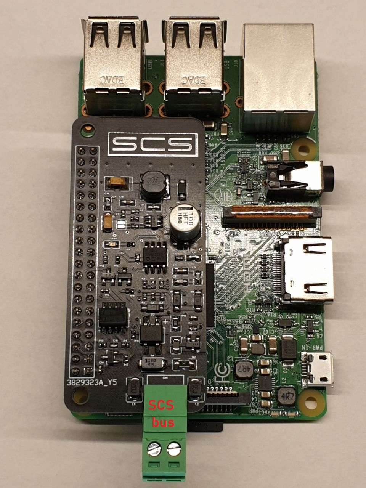

  <h1 align="center"> SCS-Raspberry-pi shield</h1>
  <h3 align="center">Senza Gateway</h3>
  
  

    <a href="https://scsshield.altervista.org/">https://scsshield.altervista.org/</a>
  

 

  

**Contatti**
* <code><a href="http://scsshields.altervista.org/contatti.html">Contatti</a></code>

**Caratteristiche**

* Raspberry completamente Isolata dal bus
* Configurazione semplice grazie alla web-app
* Possibilità di effettuare Test degli attuatori grazie alla web-app
* La comunicazione con la shield avviene in modo semplice tramite <code>MQTT</code>, con la possibilità dell'utente di sviluppare le proprie applicazioni con qualsiasi linguaggio desiderato comunicando tramite <code>MQTT Publish/Subscribe</code>

**Pin usati**

* UART0 TX (8)
* UART0 RX (10)
* GPIO 12 (32)

**Prerequisiti e preparazione dell'installazione**

* Consiglio questa versione di raspberry "2021-05-07-raspios-buster-armhf-full.zip"
scaricabile nel seguente <a href="https://drive.google.com/file/d/1n9x76HdiFXM_pIzgByjm45ASKpH6mBKp/view" target="_blank"> link </a>
* <code><a href="https://phoenixnap.com/kb/enable-ssh-raspberry-pi" target="_blank">Abilitare SSH</a></code>
* <code> <a href="https://spellfoundry.com/2016/05/29/configuring-gpio-serial-port-raspbian-jessie-including-pi-3-4/" target="_blank">Abilitare la Porta Seriale</a> <u><i>per chi usa la Raspberry pi 3 disabilitare il Bluetooth</i></u></code>
* <code> <a href="https://di-marco.net/blog/it/2020-04-18-tips-disabling_bluetooth_on_raspberry_pi/" target="_blank">Guida per disabilitare il Bluetooth</a></code>

**Installazione**
* <code>sudo apt full-upgrade</code>
* <code>sudo apt-get update</code>
* <code>sudo apt install build-essential git curl</code>
* Installare Node-Red <code>bash <(curl -sL https://raw.githubusercontent.com/node-red/linux-installers/master/deb/update-nodejs-and-nodered)</code>
* <code>sudo systemctl enable nodered.service</code>
* Dal Terminale SSH, digitare <code>git clone https://github.com/salviador/SCS-Raspberry-pi.git</code>
* <code>cd SCS-Raspberry-pi/SCS/</code>
* <code>sudo chmod +x setup.sh</code>
* <code>sudo ./setup.sh</code>
* <code>sudo pip3 install gmqtt --break-system-packages</code>
* <code>sudo pip3 install uvloop --break-system-packages</code>
* <code>sudo reboot</code>
* <code>Dopo il riavvio http://raspberrypi.local</code>

**Configurazione e Utilizzo**
* <code><a href="http://scsshields.altervista.org/">http://scsshields.altervista.org/</a></code>

