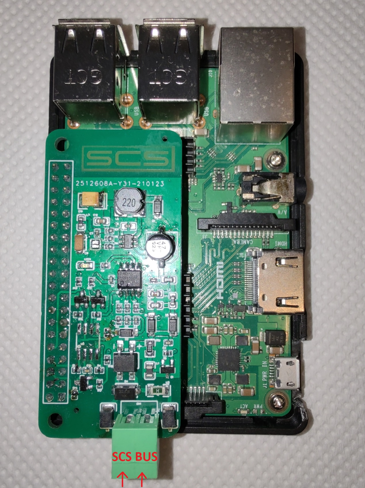

  <h1 align="center"> SCS-Raspberry-pi shield</h1>
  

    <a href="https://scsshield.altervista.org/">https://scsshield.altervista.org/</a>
  

 

  

**Contatti**
* <code><a href="http://scsshields.altervista.org/contatti.html">Contatti</a></code>

**Caratteristiche**

* Raspberry completamente Isolata dal bus
* Configurazione semplice grazie alla web-app
* Possibilità di effettuare Test degli attuatori grazie alla web-app
* La comunicazione con la shield avviene in modo semplice tramite <code>MQTT</code>, con la possibilità dell'utente di sviluppare le proprie applicazioni con qualsiasi linguaggio desiderato comunicando tramite <code>MQTT Publish/Subscribe</code>

**Pin usati**

* UART0 TX (8)
* UART0 RX (10)
* GPIO 12 (32)

**Prerequisiti e preparazione dell'installazione**

* <code>Scaricare <a href="https://www.raspberrypi.org/software/operating-systems/#raspberry-pi-os-32-bit" target="_blank"> Raspberry Pi OS with desktop and recommended software</a>
  Seguire tutte le istruzioni sul sito raspberry ufficiale</code>
* <code><a href="https://phoenixnap.com/kb/enable-ssh-raspberry-pi" target="_blank">Abilitare SSH</a></code>
* <code> <a href="http://projects.privateeyepi.com/home/home-alarm-system-project/wireless-projects/configure-the-serial-port-on-rpi2-and-rpi3" target="_blank">Abilitare la Porta Seriale</a> <u><i>per chi usa la Raspberry pi 3 disabilitare il Bluetooth</i></u></code>

**Installazione**
* <code>sudo apt-get update</code>
* Dal Terminale SSH, digitare <code>git clone https://github.com/salviador/SCS-Raspberry-pi.git</code>
* <code>cd SCS-Raspberry-pi/SCS/</code>
* <code>sudo chmod +x setup.sh</code>
* <code>sudo ./setup.sh</code>
* <code>sudo pip3 install gmqtt</code>
* <code>sudo pip3 install uvloop</code>
* <code>sudo reboot</code>
* <code>Dopo il riavvio http://ip-di-raspberry</code>

**Configurazione e Utilizzo**
* <code><a href="http://scsshields.altervista.org/">http://scsshields.altervista.org/</a></code>

